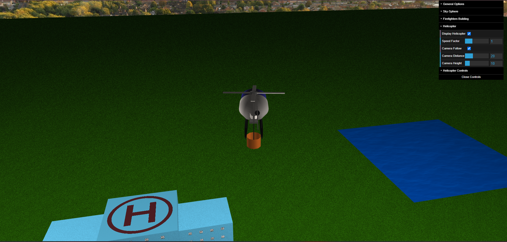

# CG 2024/2025

## Project Notes

### 1. Sky Sphere

- We had to disable face culling so that WebGL would draw the panorama (inverted sphere) faces. After trying some different values for FoV we found that 0.7 gave the best visual results. 

### 2. Fire-fighters Building

- Our fire-fighters building is totally modular: it is possible to change the color of the walls, number of windows per floor, number of floors of side modules (central module has 1 extra floor), width, depth and texture of windows. The following two images are examples where every parameter is changed from the first to the second.

### 3. Trees and Forest

- Our trees are generated procedurally based on a cone for the trunk and several stacked pyramids for the crown (we reused and adapted MyCone.js and MyPyramid.js from the previous TPs). Each tree can have a different tilt, base radius, total height, and color for the foliage. We also assigned textures to both the trunk and the leaves to achieve a more natural look.

- The forest is built as a configurable matrix of trees (rows × columns) that introduces random variation in tree shape, tilt and placement, while still keeping them inside a fixed area.

### 4. Helicopter

### 5. Water and Fire

### 6. Shaders and animation

#### 6.1 Flame ripple

### 7. Additional development

For the additional development we decided to implement the heliport texture alternating using shaders.

We also put a lot of extra work on making sure the scene lights made sense (light coming from sun position in panorama), made each fire a source of light (with attenuation) and improved some other minor details.

Before

After

